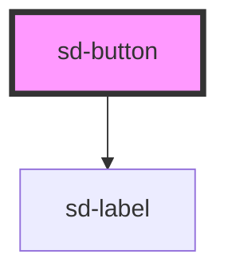

# sd-button

<!-- Auto Generated Below -->

## Properties

| Property       | Attribute       | Description                                                                           | Type                              | Default    |
| -------------- | --------------- | ------------------------------------------------------------------------------------- | --------------------------------- | ---------- |
| `disabled`     | `disabled`      | Whether the button should be disabled                                                 | `boolean`                         | `false`    |
| `fill`         | `fill`          | Whether the button should fill up all available space available to it                 | `boolean`                         | `true`     |
| `includeLabel` | `include-label` | Whether to include the label in the rendered HTML. Useful when used in a button group | `boolean`                         | `true`     |
| `label`        | `label`         | The display label for the button                                                      | `string`                          | `""`       |
| `name`         | `name`          | The name attribute for the button                                                     | `string`                          | `""`       |
| `sideMargin`   | `side-margin`   | Whether to include margin on the side of each button. Used in button groups           | `boolean`                         | `true`     |
| `type`         | `type`          | The name attribute for the button. Defaults to `button`                               | `"button" \| "reset" \| "submit"` | `"button"` |
| `value`        | `value`         | The text to be displayed on the button                                                | `string`                          | `""`       |

## Events

| Event     | Description                                            | Type                      |
| --------- | ------------------------------------------------------ | ------------------------- |
| `clicked` | Emits a `clicked` event whenever the button is clicked | `CustomEvent<MouseEvent>` |

## Dependencies

### Depends on

- [sd-label](../sd-label)

### Graph

----------------------------------------------

*Built with [StencilJS](https://stenciljs.com/)*
