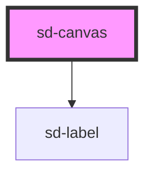

# sd-canvas

<!-- Auto Generated Below -->

## Properties

| Property | Attribute | Description                                 | Type     | Default     |
| -------- | --------- | ------------------------------------------- | -------- | ----------- |
| `height` | `height`  | The height of the canvas. Defaults to `144` | `number` | `144`       |
| `label`  | `label`   | The display label for the canvas            | `string` | `undefined` |
| `width`  | `width`   | The width of the canvas. Defaults to `144`  | `number` | `144`       |

## Methods

### `getCanvas() => Promise<HTMLCanvasElement>`

Returns a reference to the canvas element

#### Returns

Type: `Promise<HTMLCanvasElement>`

## Dependencies

### Depends on

- [sd-label](../sd-label)

### Graph

----------------------------------------------

*Built with [StencilJS](https://stenciljs.com/)*
