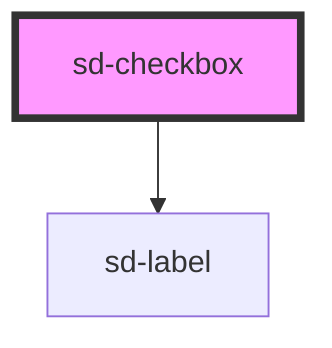

# sd-checkbox

<!-- Auto Generated Below -->

## Properties

| Property        | Attribute       | Description                                                                    | Type      | Default |
| --------------- | --------------- | ------------------------------------------------------------------------------ | --------- | ------- |
| `checked`       | `checked`       | Whether the checkbox is checked                                                | `boolean` | `false` |
| `includeLabel`  | `include-label` | Whether to include the label in the rendered HTML. Useful when used in a group | `boolean` | `true`  |
| `indeterminate` | `indeterminate` | Whether the checkbox is in an indeterminate state                              | `boolean` | `false` |
| `label`         | `label`         | The display label for the checkbox                                             | `string`  | `""`    |
| `value`         | `value`         | The value                                                                      | `string`  | `""`    |

## Events

| Event          | Description                                                                                                          | Type                      |
| -------------- | -------------------------------------------------------------------------------------------------------------------- | ------------------------- |
| `changeUpdate` | Emits a `changeUpdate` event whenever the checkbox is changed.  Fires after the checkbox loses focus                 | `CustomEvent<InputEvent>` |
| `clickUpdate`  | Emits a `clickUpdate` event whenever the checkbox is clicked.                                                        | `CustomEvent<MouseEvent>` |
| `inputUpdate`  | Emits a `inputUpdate` event whenever the checkbox is changed.  Fires every time the checkbox is checked or unchecked | `CustomEvent<InputEvent>` |

## Dependencies

### Depends on

- [sd-label](../sd-label)

### Graph

----------------------------------------------

*Built with [StencilJS](https://stenciljs.com/)*
