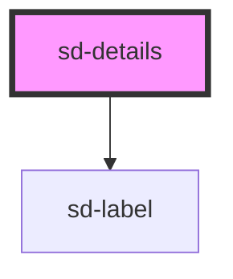

# sd-details

<!-- Auto Generated Below -->

## Properties

| Property       | Attribute       | Description                                                                                            | Type      | Default |
| -------------- | --------------- | ------------------------------------------------------------------------------------------------------ | --------- | ------- |
| `includeLabel` | `include-label` | Whether to include the label in the rendered HTML                                                      | `boolean` | `false` |
| `innerMargins` | `inner-margins` | Whether the text should have margins on the text elements                                              | `boolean` | `true`  |
| `label`        | `label`         | The display label for the details element                                                              | `string`  | `""`    |
| `opened`       | `opened`        | Whether the details element should initially be open (`true`) or closed (`false`). Defaults to `false` | `boolean` | `false` |
| `summary`      | `summary`       | The summary message for the details element                                                            | `string`  | `""`    |

## Events

| Event         | Description                                                                                       | Type                   |
| ------------- | ------------------------------------------------------------------------------------------------- | ---------------------- |
| `openChanged` | Emits an `openChanged` event whenever the details element is opened (true = open, false = closed) | `CustomEvent<boolean>` |

## Methods

### `close() => Promise<boolean>`

Closes the details element. Has no effect if the element is already closed

#### Returns

Type: `Promise<boolean>`

Returns the new state of the element (true = open, false = closed)

### `open() => Promise<boolean>`

Opens the details element. Has no effect if the element is already open

#### Returns

Type: `Promise<boolean>`

Returns the new state of the element (true = open, false = closed)

### `toggle() => Promise<boolean>`

Toggles the open state of the details element, closing it if it is open and opening it if it is closed

#### Returns

Type: `Promise<boolean>`

Returns the new state of the element (true = open, false = closed)

## Dependencies

### Depends on

- [sd-label](../sd-label)

### Graph

----------------------------------------------

*Built with [StencilJS](https://stenciljs.com/)*
