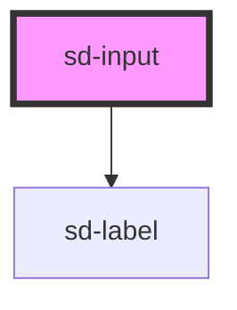

# sd-input

<!-- Auto Generated Below -->

## Properties

| Property       | Attribute      | Description                                                                                                                                     | Type                                                                                                                                                                                                                                                                                                                                                                                                                                                                                                                                                                                                                                                                                                                                                                                                                                                                                                                        | Default     |
| -------------- | -------------- | ----------------------------------------------------------------------------------------------------------------------------------------------- | --------------------------------------------------------------------------------------------------------------------------------------------------------------------------------------------------------------------------------------------------------------------------------------------------------------------------------------------------------------------------------------------------------------------------------------------------------------------------------------------------------------------------------------------------------------------------------------------------------------------------------------------------------------------------------------------------------------------------------------------------------------------------------------------------------------------------------------------------------------------------------------------------------------------------- | ----------- |
| `altText`      | `alt-text`     | The hover text for the form entry                                                                                                               | `string`                                                                                                                                                                                                                                                                                                                                                                                                                                                                                                                                                                                                                                                                                                                                                                                                                                                                                                                    | `undefined` |
| `autocomplete` | `autocomplete` | The autocomplete type for the select element. Values taken from here: https://developer.mozilla.org/en-US/docs/Web/HTML/Attributes/autocomplete | `"name" \| "off" \| "on" \| "honorific-prefix" \| "given-name" \| "additional-name" \| "family-name" \| "honorific-suffix" \| "nickname" \| "email" \| "username" \| "new-password" \| "current-password" \| "one-time-code" \| "organization-title" \| "organization" \| "street-address" \| "address-line1" \| "address-line2" \| "address-line3" \| "address-level4" \| "address-level3" \| "address-level2" \| "address-level1" \| "country" \| "country-name" \| "postal-code" \| "cc-name" \| "cc-given-name" \| "cc-additional-name" \| "cc-family-name" \| "cc-number" \| "cc-exp" \| "cc-exp-month" \| "cc-exp-year" \| "cc-csc" \| "cc-type" \| "transaction-currency" \| "transaction-amount" \| "language" \| "bday" \| "bday-day" \| "bday-month" \| "bday-year" \| "sex" \| "tel" \| "tel-country-code" \| "tel-national" \| "tel-area-code" \| "tel-local" \| "tel-extension" \| "impp" \| "url" \| "photo"` | `"off"`     |
| `disabled`     | `disabled`     | Whether the input should be disabled. Defaults to `false`                                                                                       | `boolean`                                                                                                                                                                                                                                                                                                                                                                                                                                                                                                                                                                                                                                                                                                                                                                                                                                                                                                                   | `false`     |
| `inputmode`    | `inputmode`    | The input mode to use for virtual keyboards                                                                                                     | `"decimal" \| "email" \| "none" \| "numeric" \| "search" \| "tel" \| "text" \| "url"`                                                                                                                                                                                                                                                                                                                                                                                                                                                                                                                                                                                                                                                                                                                                                                                                                                       | `undefined` |
| `label`        | `label`        | The display label for the input                                                                                                                 | `string`                                                                                                                                                                                                                                                                                                                                                                                                                                                                                                                                                                                                                                                                                                                                                                                                                                                                                                                    | `undefined` |
| `pattern`      | `pattern`      | A validation regex for the input. Will show a checkmark next to the input when validated                                                        | `string`                                                                                                                                                                                                                                                                                                                                                                                                                                                                                                                                                                                                                                                                                                                                                                                                                                                                                                                    | `undefined` |
| `placeholder`  | `placeholder`  | The placeholder value for the input field                                                                                                       | `string`                                                                                                                                                                                                                                                                                                                                                                                                                                                                                                                                                                                                                                                                                                                                                                                                                                                                                                                    | `undefined` |
| `readonly`     | `readonly`     | Whether the input should be read only. Defaults to `false`                                                                                      | `boolean`                                                                                                                                                                                                                                                                                                                                                                                                                                                                                                                                                                                                                                                                                                                                                                                                                                                                                                                   | `false`     |
| `required`     | `required`     | Whether or not the input is required. Defaults to `false`                                                                                       | `boolean`                                                                                                                                                                                                                                                                                                                                                                                                                                                                                                                                                                                                                                                                                                                                                                                                                                                                                                                   | `false`     |
| `type`         | `type`         | The type for the input box. Defaults to `text`                                                                                                  | `"email" \| "number" \| "password" \| "search" \| "tel" \| "text" \| "url"`                                                                                                                                                                                                                                                                                                                                                                                                                                                                                                                                                                                                                                                                                                                                                                                                                                                 | `undefined` |
| `value`        | `value`        | A predefined value for the input                                                                                                                | `string`                                                                                                                                                                                                                                                                                                                                                                                                                                                                                                                                                                                                                                                                                                                                                                                                                                                                                                                    | `undefined` |

## Events

| Event          | Description                                                                                                   | Type                                                |
| -------------- | ------------------------------------------------------------------------------------------------------------- | --------------------------------------------------- |
| `changeUpdate` | Emits a `changeUpdate` event whenever the input is changed. Fires after the input loses focus                 | `CustomEvent<string>`                               |
| `inputUpdate`  | Emits a `inputUpdate` event whenever the input is changed. Fires every time something is typed into the input | `CustomEvent<{ data: string; inputType: string; }>` |

## Dependencies

### Depends on

- [sd-label](../sd-label)

### Graph

----------------------------------------------

*Built with [StencilJS](https://stenciljs.com/)*
