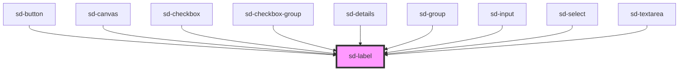

# sd-label

<!-- Auto Generated Below -->

## Properties

| Property      | Attribute      | Description                                                                                 | Type      | Default |
| ------------- | -------------- | ------------------------------------------------------------------------------------------- | --------- | ------- |
| `countOffset` | `count-offset` | Whether the textarea should have a -20px top margin. Used for alignment with other elements | `boolean` | `false` |
| `text`        | `text`         | The text to show in the label                                                               | `string`  | `""`    |

## Dependencies

### Used by

 - [sd-button](../sd-button)
 - [sd-canvas](../sd-canvas)
 - [sd-checkbox](../sd-checkbox)
 - [sd-checkbox-group](../sd-checkbox-group)
 - [sd-details](../sd-details)
 - [sd-group](../sd-group)
 - [sd-input](../sd-input)
 - [sd-select](../sd-select)
 - [sd-textarea](../sd-textarea)

### Graph

----------------------------------------------

*Built with [StencilJS](https://stenciljs.com/)*
