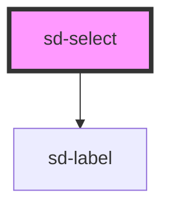

# sd-select

<!-- Auto Generated Below -->

## Properties

| Property       | Attribute       | Description                                                                                                                                     | Type                                                                                                                                                                                                                                                                                                                                                                                                                                                                                                                                                                                                                                                                                                                                                                                                                                                                                                                        | Default     |
| -------------- | --------------- | ----------------------------------------------------------------------------------------------------------------------------------------------- | --------------------------------------------------------------------------------------------------------------------------------------------------------------------------------------------------------------------------------------------------------------------------------------------------------------------------------------------------------------------------------------------------------------------------------------------------------------------------------------------------------------------------------------------------------------------------------------------------------------------------------------------------------------------------------------------------------------------------------------------------------------------------------------------------------------------------------------------------------------------------------------------------------------------------- | ----------- |
| `autocomplete` | `autocomplete`  | The autocomplete type for the select element. Values taken from here: https://developer.mozilla.org/en-US/docs/Web/HTML/Attributes/autocomplete | `"name" \| "off" \| "on" \| "honorific-prefix" \| "given-name" \| "additional-name" \| "family-name" \| "honorific-suffix" \| "nickname" \| "email" \| "username" \| "new-password" \| "current-password" \| "one-time-code" \| "organization-title" \| "organization" \| "street-address" \| "address-line1" \| "address-line2" \| "address-line3" \| "address-level4" \| "address-level3" \| "address-level2" \| "address-level1" \| "country" \| "country-name" \| "postal-code" \| "cc-name" \| "cc-given-name" \| "cc-additional-name" \| "cc-family-name" \| "cc-number" \| "cc-exp" \| "cc-exp-month" \| "cc-exp-year" \| "cc-csc" \| "cc-type" \| "transaction-currency" \| "transaction-amount" \| "language" \| "bday" \| "bday-day" \| "bday-month" \| "bday-year" \| "sex" \| "tel" \| "tel-country-code" \| "tel-national" \| "tel-area-code" \| "tel-local" \| "tel-extension" \| "impp" \| "url" \| "photo"` | `"off"`     |
| `autofocus`    | `autofocus`     | Whether the select should be automatically focused on load                                                                                      | `boolean`                                                                                                                                                                                                                                                                                                                                                                                                                                                                                                                                                                                                                                                                                                                                                                                                                                                                                                                   | `false`     |
| `disabled`     | `disabled`      | Whether the select should be disabled                                                                                                           | `boolean`                                                                                                                                                                                                                                                                                                                                                                                                                                                                                                                                                                                                                                                                                                                                                                                                                                                                                                                   | `false`     |
| `fill`         | `fill`          | Whether the select should fill up all available space available to it                                                                           | `boolean`                                                                                                                                                                                                                                                                                                                                                                                                                                                                                                                                                                                                                                                                                                                                                                                                                                                                                                                   | `true`      |
| `includeLabel` | `include-label` | Whether to include the label in the rendered HTML. Useful when used in a button group                                                           | `boolean`                                                                                                                                                                                                                                                                                                                                                                                                                                                                                                                                                                                                                                                                                                                                                                                                                                                                                                                   | `true`      |
| `label`        | `label`         | The display label for the select element                                                                                                        | `string`                                                                                                                                                                                                                                                                                                                                                                                                                                                                                                                                                                                                                                                                                                                                                                                                                                                                                                                    | `""`        |
| `multiple`     | `multiple`      | Whether the select should allow for multiple selections                                                                                         | `boolean`                                                                                                                                                                                                                                                                                                                                                                                                                                                                                                                                                                                                                                                                                                                                                                                                                                                                                                                   | `false`     |
| `name`         | `name`          | The name attribute for the select control                                                                                                       | `string`                                                                                                                                                                                                                                                                                                                                                                                                                                                                                                                                                                                                                                                                                                                                                                                                                                                                                                                    | `""`        |
| `options`      | `options`       | The select options. Can be set by passing in a JSON string or by setting the property through JavaScript.                                       | `(Option \| OptGroup)[] \| string`                                                                                                                                                                                                                                                                                                                                                                                                                                                                                                                                                                                                                                                                                                                                                                                                                                                                                          | `[]`        |
| `required`     | `required`      | Whether the select should be required                                                                                                           | `boolean`                                                                                                                                                                                                                                                                                                                                                                                                                                                                                                                                                                                                                                                                                                                                                                                                                                                                                                                   | `false`     |
| `sideMargin`   | `side-margin`   | Whether to include margin on the side of each button. Used in button groups                                                                     | `boolean`                                                                                                                                                                                                                                                                                                                                                                                                                                                                                                                                                                                                                                                                                                                                                                                                                                                                                                                   | `true`      |
| `size`         | `size`          | The number of rows that should be visible at one time.                                                                                          | `number`                                                                                                                                                                                                                                                                                                                                                                                                                                                                                                                                                                                                                                                                                                                                                                                                                                                                                                                    | `undefined` |

## Events

| Event          | Description                                                                                              | Type                      |
| -------------- | -------------------------------------------------------------------------------------------------------- | ------------------------- |
| `changeUpdate` | Emits a `changed` event whenever the value of the select is explicitly changed and committed by the user | `CustomEvent<InputEvent>` |
| `inputUpdate`  | Emits an `input` event whenever the value of the select is changed by the user                           | `CustomEvent<InputEvent>` |

## Dependencies

### Depends on

- [sd-label](../sd-label)

### Graph

----------------------------------------------

*Built with [StencilJS](https://stenciljs.com/)*
