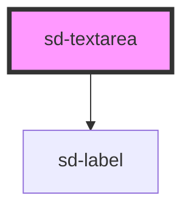

# sd-textarea

<!-- Auto Generated Below -->

## Properties

| Property      | Attribute     | Description                                                   | Type      | Default     |
| ------------- | ------------- | ------------------------------------------------------------- | --------- | ----------- |
| `disabled`    | `disabled`    | Whether the textarea should be disabled. Defaults to `false`  | `boolean` | `false`     |
| `label`       | `label`       | The display label for the textarea                            | `string`  | `""`        |
| `maxlength`   | `maxlength`   | The maximum length of the content of the textarea             | `number`  | `0`         |
| `minlength`   | `minlength`   | The minimum length of the content of the textarea             | `number`  | `0`         |
| `name`        | `name`        | The name of the textarea                                      | `string`  | `undefined` |
| `placeholder` | `placeholder` | The placeholder value for the input field                     | `string`  | `undefined` |
| `readonly`    | `readonly`    | Whether the textarea should be read only. Defaults to `false` | `boolean` | `false`     |
| `required`    | `required`    | Whether or not the textarea is required. Defaults to `false`  | `boolean` | `false`     |
| `value`       | `value`       | A predefined value for the textarea                           | `string`  | `""`        |

## Events

| Event          | Description                                                                                                         | Type                      |
| -------------- | ------------------------------------------------------------------------------------------------------------------- | ------------------------- |
| `changeUpdate` | Emits a `changeUpdate` event whenever the textarea is changed. Fires after the textarea loses focus                 | `CustomEvent<InputEvent>` |
| `inputUpdate`  | Emits a `inputUpdate` event whenever the textarea is changed. Fires every time something is typed into the textarea | `CustomEvent<InputEvent>` |

## Dependencies

### Depends on

- [sd-label](../sd-label)

### Graph

----------------------------------------------

*Built with [StencilJS](https://stenciljs.com/)*
